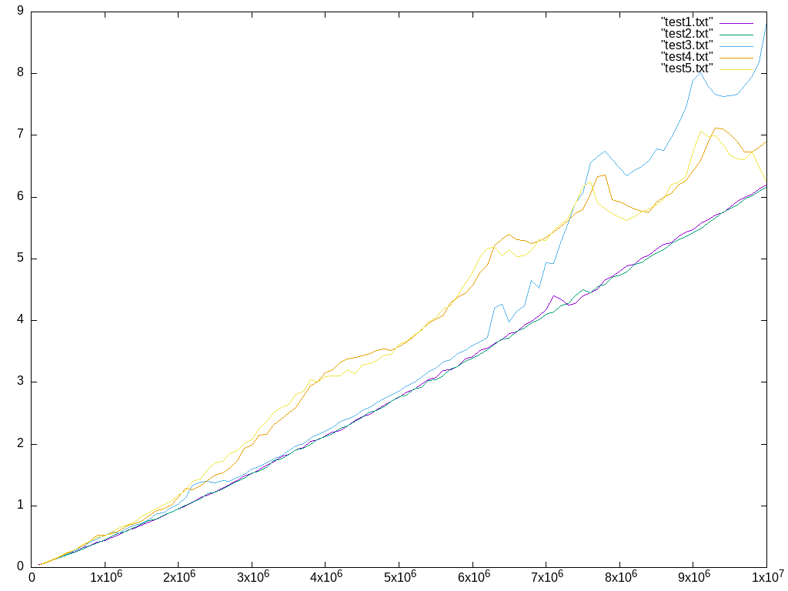
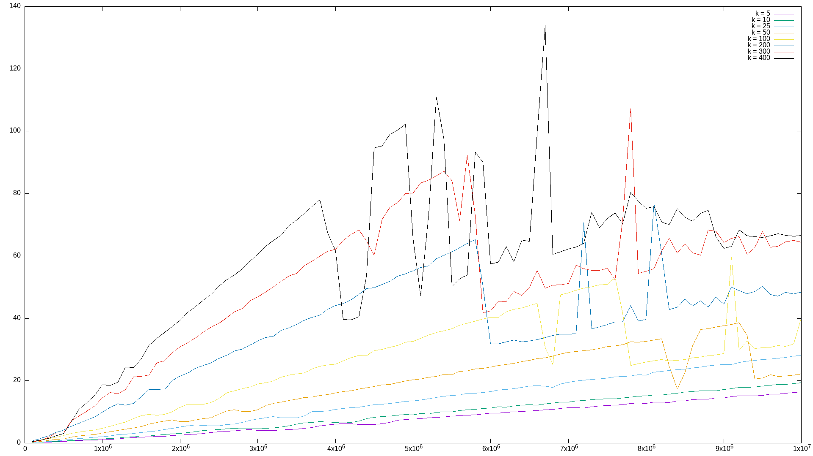
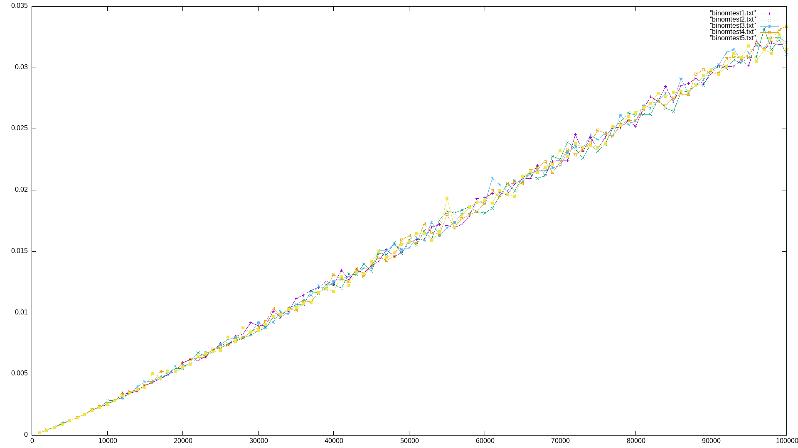

# HeapSort на двоичной куче #
HeapSort на двоичной куче работает за O(n log n) `в среднем и в худшем случае`. Он является одним из самых быстрых из известных сортировок. Он является устойчивым, но не является адаптивным. Он не является стабильным, поскольку не сохраняет относительный порядок равных элементов.

# HeapSort на k-ичной куче #
HeapSort на k-ичной куче работает за O(n log n) `в среднем и в худшем случае`. Он является одним из самых быстрых из известных сортировок. Он является устойчивым, но не является адаптивным. Он не является стабильным, поскольку не сохраняет относительный порядок равных элементов.

# HeapSort на биномиальной куче #
HeapSort на биномиальной куче работает за O(n log n) `в среднем и в худшем случае`. Он является одним из самых быстрых из известных сортировок. Он является устойчивым, но не является адаптивным. Он не является стабильным, поскольку не сохраняет относительный порядок равных элементов.

@leshicorn