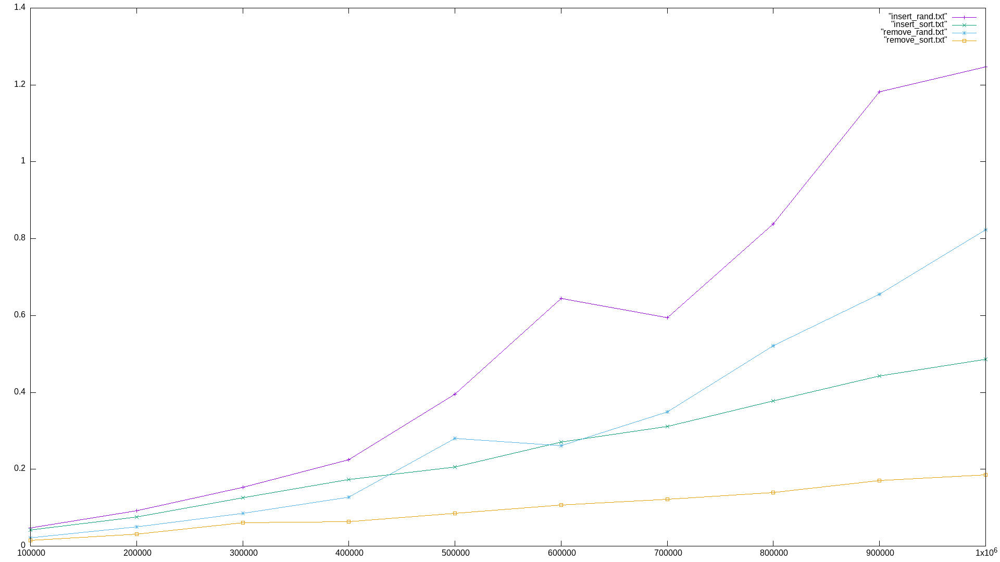
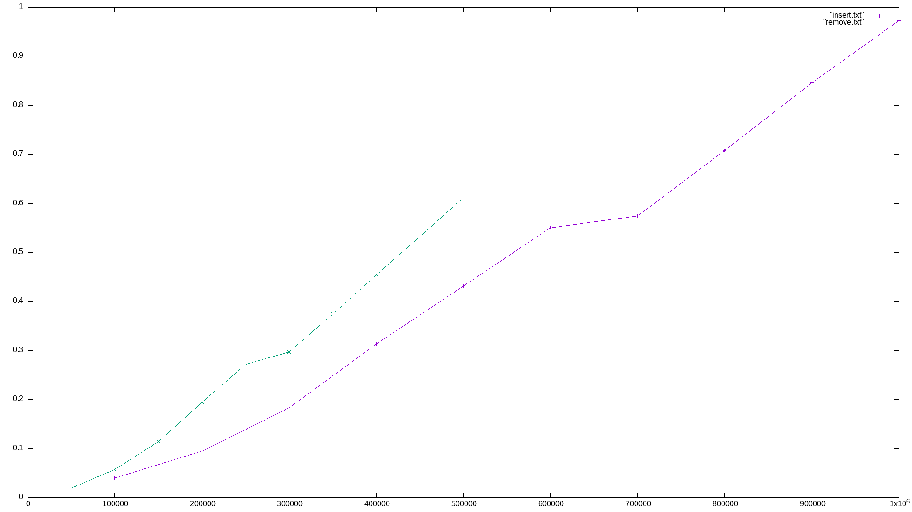
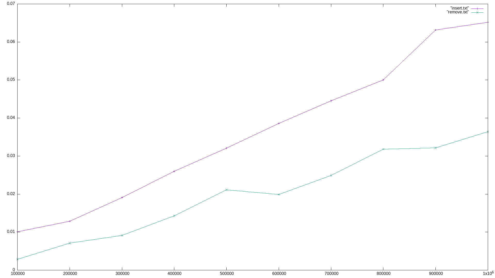
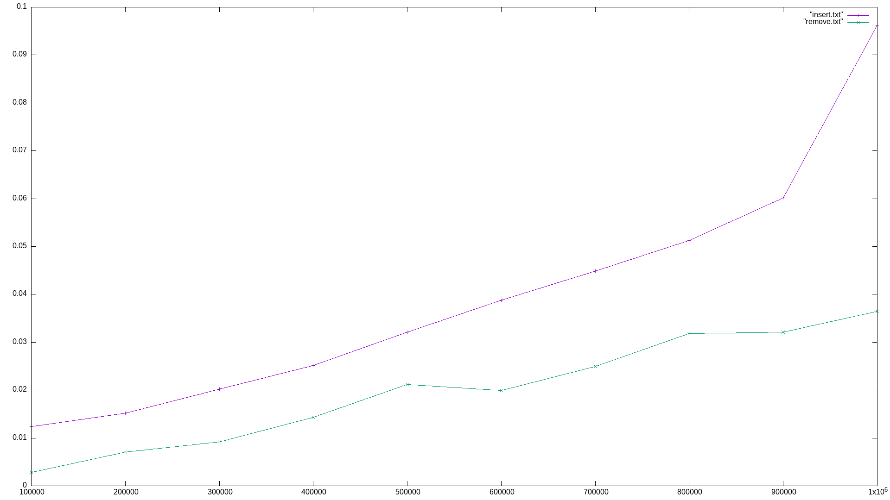
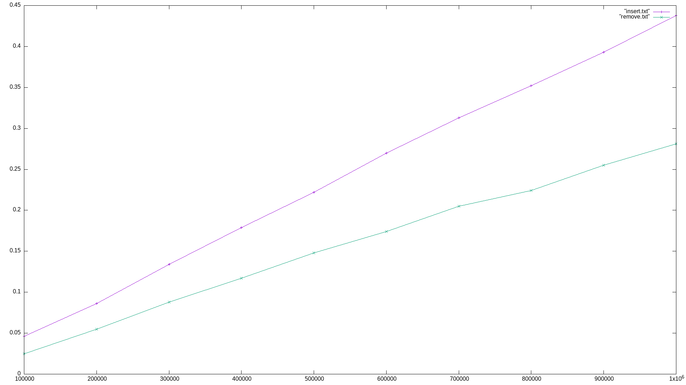
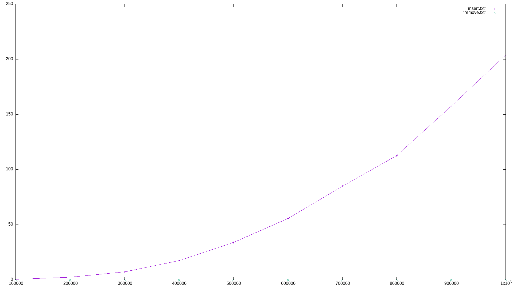

# AVL - дерево #
В AVL - дереве операции вставки и удаления работают за O(log n) `в среднем и в худшем случае`. Операция поиска работает за O(log n) `в среднем и в худшем случае`. AVL - дерево является устойчивым, но не является адаптивным. Оно не является стабильным, поскольку не сохраняет относительный порядок равных элементов.

# AVL - split/merge tree #
В AVL-дереве с операциями split и merge операции вставки и удаления работают за O(log n) `в среднем и в худшем случае`. Операция поиска работает за O(log n) `в среднем и в худшем случае`. AVL - split/merge дерево является устойчивым, но не является адаптивным. Оно не является стабильным, поскольку не сохраняет относительный порядок равных элементов.

# Декартово дерево #
В Декартовом дереве операции вставки и удаления работают за O(log n) `в среднем и в худшем случае`. Операция поиска работает за O(log n) `в среднем и в худшем случае`. Декартово дерево является устойчивым, но не является адаптивным. Оно не является стабильным, поскольку не сохраняет относительный порядок равных элементов.

# Splay дерево #
В Splay дереве операции вставки и удаления работают за O(log n) `в среднем и в худшем случае`. Операция поиска работает за O(log n) `в среднем и в худшем случае`. Splay дерево является устойчивым, но не является адаптивным. Оно не является стабильным, поскольку не сохраняет относительный порядок равных элементов.

# B дерево #
В B дереве операции вставки и удаления работают за O(log n) `в среднем и в худшем случае`. Операция поиска работает за O(log n) `в среднем и в худшем случае`. B дерево является устойчивым, но не является адаптивным. Оно не является стабильным, поскольку не сохраняет относительный порядок равных элементов.

# Skip List #
В Skip List операции вставки и удаления работают за O(log n) `в среднем и в худшем случае`. Операция поиска работает за O(log n) `в среднем и в худшем случае`. Skip List является устойчивым, но не является адаптивным. Оно не является стабильным, поскольку не сохраняет относительный порядок равных элементов.

@leshicorn