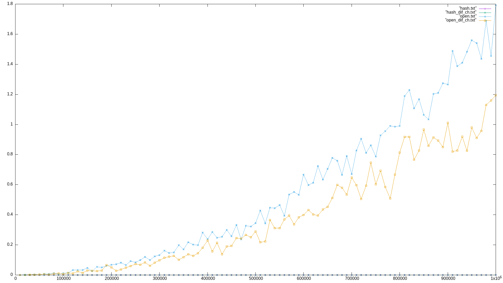

# Хэширование #
Исходя из данных, полученных опытным путем, можно сделать вывод, что открытое хэширование на порядок медленнее, чем хэширование цепочками. 
В открытом хэшировании операция поиска элемента в хэш-таблице требует больше времени, чем в хэш-таблице с цепочками.
Это связано с тем, что в открытом хэшировании при поиске элемента в хэш-таблице необходимо просматривать все элементы, которые хранятся в ячейке, а в хэш-таблице с цепочками достаточно просмотреть только одну ячейку.
Также в открытом хэшировании при удалении элемента из хэш-таблицы необходимо просматривать все элементы, которые хранятся в ячейке, а в хэш-таблице с цепочками достаточно просмотреть только одну ячейку.
[