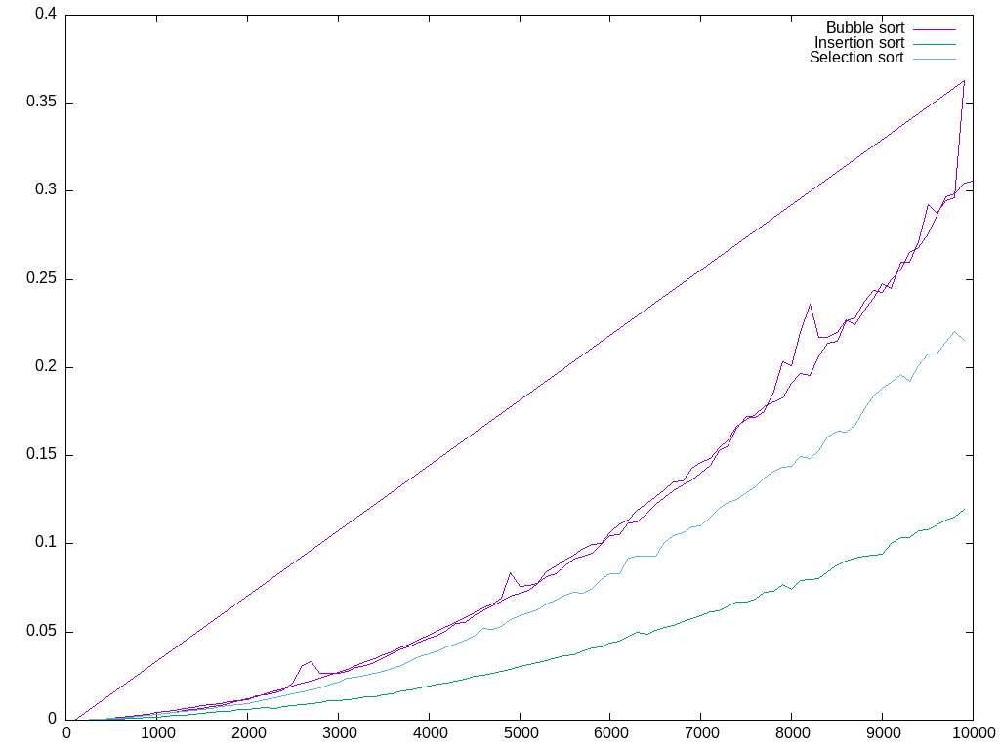
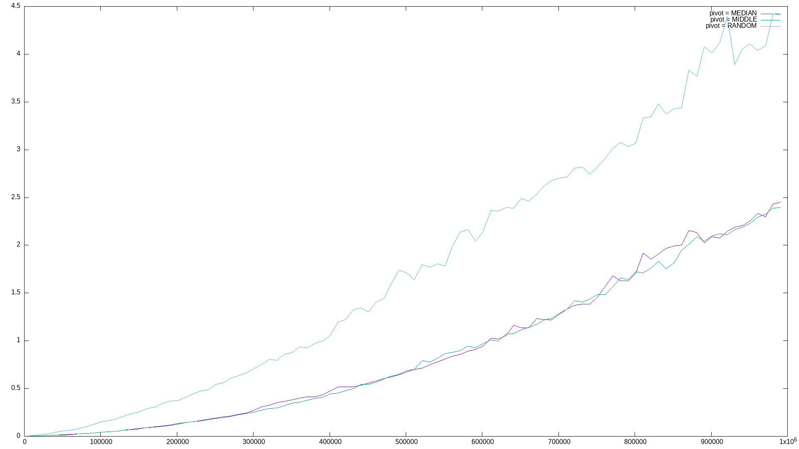
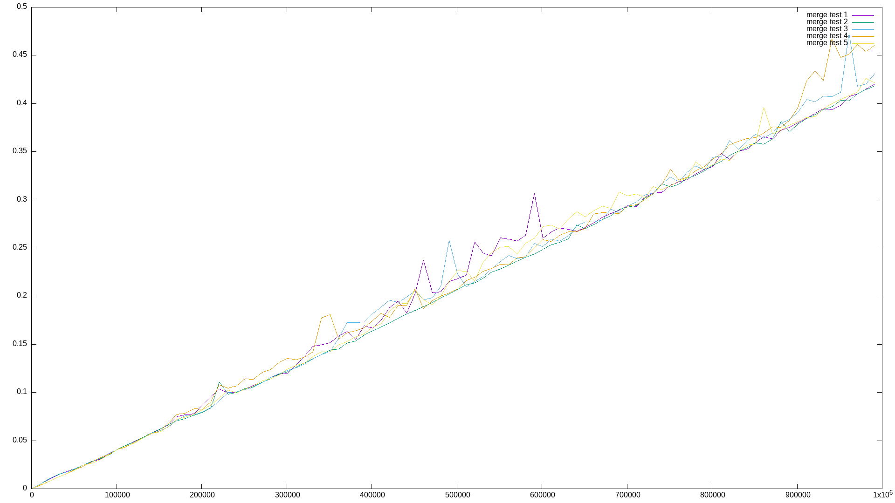

# Квадратичные сортировки #
Как оказалось, сортировка пузырьком в среднем самая быстрая из квадратичных сортировок, но в худшем случае она работает за `O(n^2)`. Сортировка вставками работает за `O(n^2)` в среднем и в худшем случае. Сортировка выбором работает за `O(n^2)` в среднем и в худшем случае.
Поэтому, если и приходится использовать квадратичные сортировки, то лучше использовать сортировку пузырьком, так как она в среднем быстрее.

# Быстрая сортировка #
Быстрая сортировка работает за O(n log n) `в среднем и в худшем случае`. Она является одной из самых быстрых из известных сортировок.

# Сортировка слиянием #
Сортировка слиянием работает за O(n log n) `в среднем и в худшем случае`. Она является самой быстрой из известных стабильных сортировок. В среднем она оказалась быстрее "быстрой сортировки".
